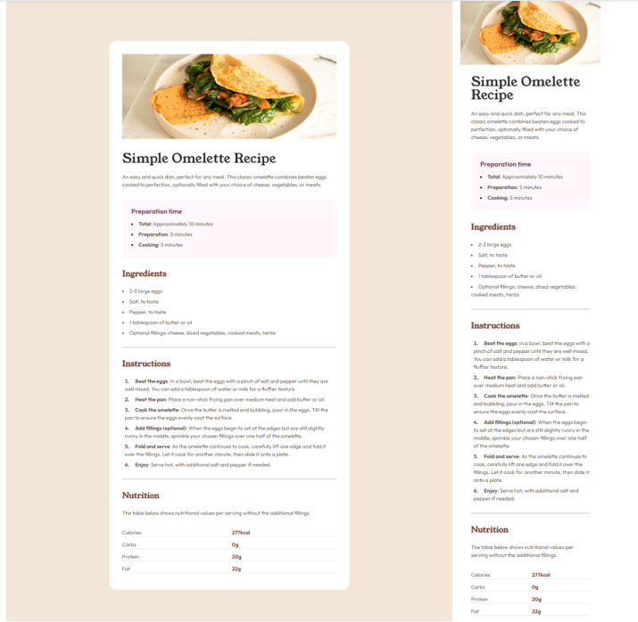

# Frontend Mentor - Recipe page

This is a solution to the [Recipe Page Challenge on Frontend Mentor](https://www.frontendmentor.io/challenges/recipe-page-KiTsR8QQKm). 

## Overview

### Screenshot

### Links
<!-- - Github Site URL: [Josmiga - Social links profile](https://josmiga.github.io/social-links-profile-main/) -->

## My process
### Built with
- Semantic HTML5 markup
- CSS custom properties
- Flexbox

## Author
- Frontend Mentor - [@Josmiga](https://www.frontendmentor.io/profile/Josmiga)
- Twitter - [@josmigga](https://x.com/josmigga)